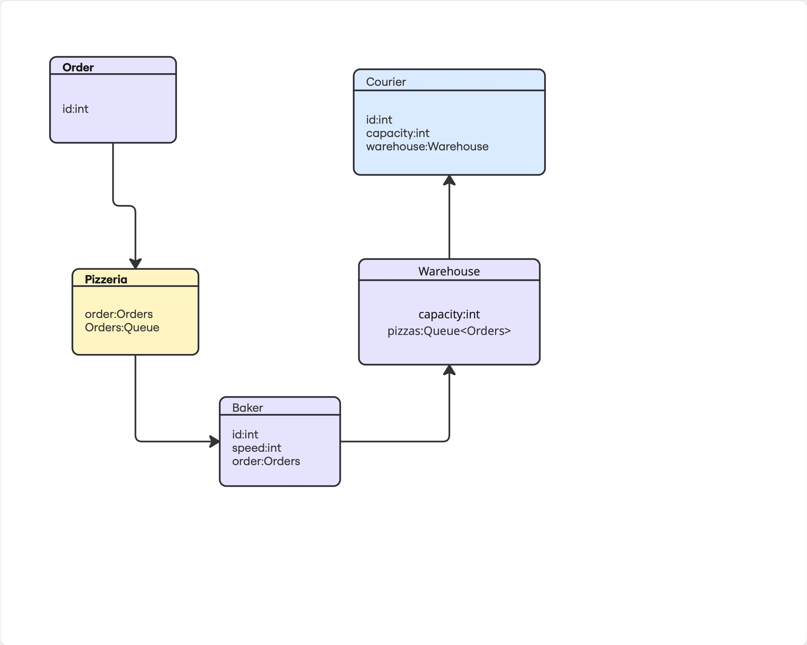

# Задача "Пиццерия"
В данной задаче реализована имитация работы пиццерии.

### Принцип работы

1. В пиццерию поступает заказ, которому присваивается идентификатор. 
2. Пекарь берёт заказ и начинает изготовление пиццы. В пиццерии несколько пекарей. У каждого из них свой идентификатор и скорость выполнения работы.
3. После изготовления пиццы, пекарь относит её на склад. У склада есть максимальная вместимость. 
4. Курьер забирает пиццу со склада и везет покупателю по номеру заказа. У каждого курьера свой идентификатор и вместимость багажника машины.

### Время работы

Пиццерия работает ограниченное время. После сигнала окончания работы прием заказов останавливается. Далее, дождавшись завершения открытых заказов, пиццерия завершает работу.

### Параметры пиццерии

В качестве конфигурационного файла с параметрами пиццерии использован JSON: 
[config.json](src/main/resources/config.json)

### UML-диаграмма 

UML-диаграмма представлена на картинке:

На данной UML-диаграмме изображен принцип работы программы. Имитируется работа пиццерии.

1. Формируется заказ. Ему присваивается идентификатор (номер заказа);
2. После формирования заказа он передается в пиццерию. Пиццерия принимает заказ. В пиццерии есть очередь заказов.
3. После того как пиццерия приняла заказ, свободный пекарь (если есть) берет заказ и начинает изготовление пиццы. Пекари имеют собственные идентификаторы, по которым возможно их различать. Кроме того, каждый пекарь изготавливает пиццу с разной скоростью. Если свободных пекарей нет, то заказ не выполняет никто, он помещается в очередь. Его возьмет первый освободившийся пекарь.  
4. После того как пекарь изготовил заказ, он относит пиццу на склад. Склад принимает пиццу, если он еще не заполнен. У склада есть максимальная вместимость. Если склад заполнен, то пекарь ждет возможности оставить пиццу. Он оставит ее, как только освободится место на складе.  
5. Как только пицца помещается на склад, ее может забрать курьер (если есть). У каждого курьера есть свой идентификатор. Кроме того, у каждого курьера разная вместимость багажника. Если свободных курьеров нет, то пицца лежит на складе, пока ее никто не заберет. Курьеры доставляют заказы покупателям.  

